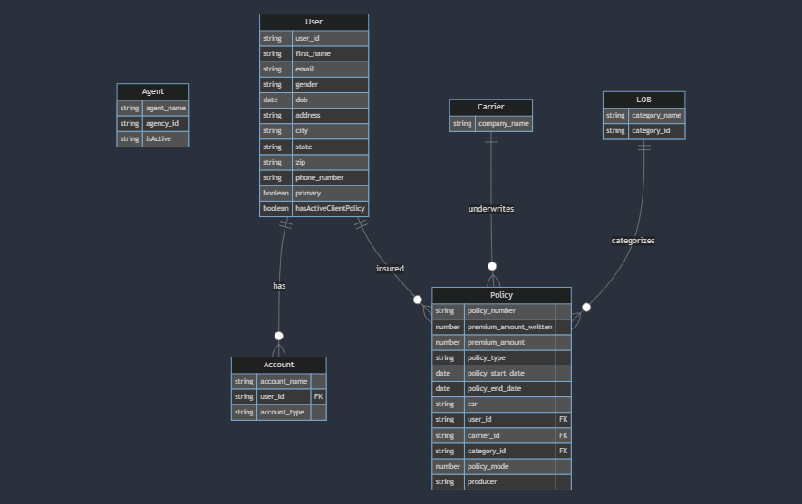

# MongoDB & Node.js Insurance Data Management API

# Description

This repository is a demonstration of a backend system designed for the efficient handling and management of insurance-related data, showcasing the integration of MongoDB and Node.js. The system is architected to manage a variety of data entities, including Agents, Users, User's Accounts, Policy Categories, Policy Carriers, and Policy Information, each within its dedicated MongoDB collection. This setup demonstrates a comprehensive approach to complex data management, API development, and system optimization. 

<!-- TABLE OF CONTENTS -->
### Table of Contents
* [Assignment](#assignments)
* [DB Architecture](#dbarchitecture)
* [Installation](#installation) 
* [Central Log system](#logs) 
</br>
</br> 


## Assignments: <i id="assignments"></i>

[✅] Develop the below workflow in nodejs for backend development </br>
[✅] Created the API to upload the attached XLSX/CSV data into MongoDB. (It accomplished using worker threads)    
[✅] Created the Search API to find policy info with the help of the username. </br>
[✅] Created the API to provide aggregated policy by each user.  </br>
[✅] Implemented real-time monitoring of the Node server's CPU usage, with a system in place to restart the server upon reaching 70% utilization. This functionality is achieved through the integration of PM2 and a dedicated script that continuously checks CPU utilization, with PM2 handling the server restarts.</br>
[✅] Created a post-api in the above server to takes the message, day, and time in body parameters and it inserts that message into DB at that particular day and time.</br>
[✅] Centralized log monitoring system for complete application using winston</br>


</br>
 

## DB Architecture: <i id="dbarchitecture"></i> 
```
The system is structured into several distinct collections within MongoDB, each tailored to handle specific segments of insurance data:

Agent: Manages agent names and related information.

User: Contains user details such as first name, DOB, address, phone number, state, zip code, email, gender, and userType.

User's Account: Keeps track of user account names.

Policy Category (LOB): Manages different categories of insurance policies.

Policy Carrier: Stores information about policy carriers.

Policy Info: Holds comprehensive policy details including policy number, policy start and end dates, policy category, collection id, company collection id, and user id.




```
</br>


## Installation: <i id="installation"></i> 
```
Unzip file
npm install
```
</br>

## Usage: <i id="usage"></i> 
<b>1. Variable in `.env.local` file or use given defaults</b>
```
MONGODB_STRING="mongodb_connection_string"
PORT=3000
```

<b>2. Start your server with PM2:</b>
```
pm2 start index.js --name="myServer"

```
<b>2. start your monitoring script with PM2 as well</b>
```
pm2 start monitor.js --name="cpuMonitor"

```


</br>
 
## Central Log system: <i id="logs"></i>
This project doesn't use console.log anywhere, instead it uses [winston](https://www.npmjs.com/package/winston) to generate a central log file,       
If you have used the app or tests then log file can be found here:           
`combined.log` and  `error.log` in logs folder

</br>


## API's: <i id="api"></i>
We added the postman api collection in api folder of the code base   

</br>
 
 

# References:

# How to run locally

This demo includes a bot that you will run locally, so before running the code, you will have to set up an Azure Bot Service resource.

1. [Clone the code](#clone-the-code) 
1. [Prepare and run the code](#prepare-and-run-the-code)

## Clone the code

To host this demo, you will need to clone the code and run locally.

<details><summary>Clone the JavaScript project</summary>

1. Clone this repository 

</details>  

<details><summary>JavaScript</summary>

1. Save the Mongodb credentials and port to `/.env.local`
   -  ```
    MONGODB_STRING="mongodb_connection_string"
    PORT=3000
      ```
1. Save the configuration for pm2 `/ecosystem.config.js`
   

</details>

 
</details>

During development, you will run the backend locally. You can use [ngrok](https://ngrok.com/) to expose your bot server on a public URL.

1. Run `ngrok http -host-header=localhost:3000 3000`
 
 